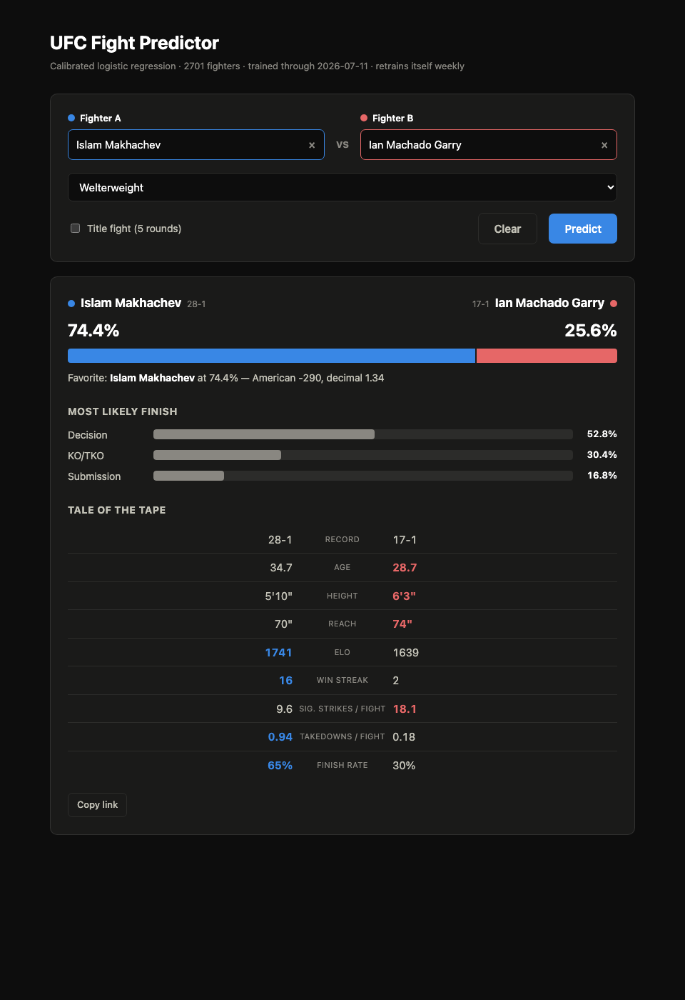

# UFC Fight Outcome Prediction

[](https://ufc-fight-predictor-osdb.onrender.com)

[](LICENSE)


Predicts UFC fight outcomes — **win probability, betting odds, and finish method** — from a
self-updating scrape of [ufcstats.com](http://ufcstats.com). Built end-to-end: a resilient
scraper, a leakage-audited feature pipeline, a Logistic-Regression-vs-XGBoost study, and a
Flask app that quotes any hypothetical matchup.

**▶ Live demo: https://ufc-fight-predictor-osdb.onrender.com** — free tier, so the first load
after a while may take ~30–60s to wake.



---

## The headline finding

**A plain, calibrated Logistic Regression matches or beats XGBoost on this task** — so the simpler,
fully interpretable model ships. Both land at the honest **~62–64% accuracy** ceiling for UFC
prediction, with well-calibrated probabilities you can quote as odds. Anything claiming 90% here
would mean data leakage had crept back in.

Test-set log-loss (temporal holdout, lower is better; coin-flip = 0.693):

| Model | Log-loss | Brier | Accuracy |
|---|---|---|---|
| Coin flip (p = 0.5) | 0.6931 | 0.2500 | 50.0% |
| **Logistic Regression (calibrated) — shipped** | **0.6469** | **0.2276** | 61.8% |
| Logistic Regression (uncalibrated) | 0.6491 | 0.2288 | 61.8% |
| XGBoost (difference features) | 0.6533 | 0.2307 | 61.3% |
| XGBoost (raw per-fighter features) | 0.6487 | 0.2283 | 63.6% |

**Why linear wins:** the signal is genuinely weak and close to additive — "younger fighter, higher
Elo, better record, longer reach" pushes the odds smoothly one way, with few higher-order
interactions for trees to exploit. XGBoost's extra flexibility mostly buys variance, not accuracy.
The top predictor in both models is **`elo_diff`** — a strength-of-schedule signal that a raw
win/loss record can't capture.

---

## What the app does

Pick any two of **2,701 fighters** and a division, and it returns:

- **Win probability** as a split meter, plus **American & decimal odds**
- **Finish-method distribution** — Decision / KO-TKO / Submission
- **Tale of the Tape** — age, height, reach, Elo, record, striking output, takedown rate, finish
  rate, with the edge highlighted per row
- **Head-to-head history** — prior meetings between the two, if any
- Division/gender-scoped fighter search and shareable deep-link URLs

Fighters show their **full professional records** (e.g. Makhachev 28-1), scraped from the
ufcstats page header — not just their UFC-only bout count.

---

## How it works

```
scrape ufcstats  →  clean  →  point-in-time features  →  model  →  Flask app
   (src.scraping)   (src.data_    (src.feature_        (src.model_   (app/)
                     preprocessing) engineering)         training)
```

The whole thing **retrains itself weekly** (`python -m src.update`, driven by a launchd agent):
it scrapes new events, rebuilds features on a rolling 12-month temporal holdout, re-benchmarks
Logistic Regression vs XGBoost, and refits the shipped models on all data.

### Two leakage traps this project takes seriously

Sports-outcome models are easy to fool yourself with. Two guarantees are enforced on every rebuild:

1. **Point-in-time features only.** Every feature for a fight is built from that fighter's history
   *strictly before* the fight date (`shift` / `cumsum` career stats, a chronological Elo walk).
   A fight's own stats never feed its own prediction.
2. **No corner leakage.** ufcstats lists a red and blue corner, and the red corner wins ~57% by
   promoter convention — the pre-fix "corner A" win rate was **0.643**. Features are symmetric
   `a − b` differences with a seeded random corner swap, so the model learns skill, not seating.

The scraper gets past the site's *"Checking your browser…"* wall by solving its **SHA-256
proof-of-work** in a few lines of Python — no Playwright or headless Chromium needed.

---

## Run it locally

```bash
python -m venv .venv && source .venv/bin/activate
pip install -r requirements.txt          # macOS + xgboost: also `brew install libomp`

python -m app.app                         # → http://127.0.0.1:5001
```

The app serves from the committed models and snapshots — no scrape needed to try it. To rebuild
features and retrain from the existing raw data (no network):

```bash
python -m src.update --skip-scrape
```

---

## Project structure

```
config.yaml   tunable knobs — scrape delays, Elo base/K, holdout window, seed, app port
src/          data + modeling pipeline
  config.py              paths + method/division vocab; loads tunables from config.yaml
  scraping.py            proof-of-work scraper (incremental, cached, resumable)
  data_preprocessing.py  clean raw CSVs → typed, filtered frames
  feature_engineering.py point-in-time features, Elo walk, temporal split, snapshots
  model_training.py      LR vs XGBoost, isotonic calibration
  update.py              weekly self-retrain entrypoint
app/          Flask serving layer (app.py, utils.py, templates/index.html)
notebooks/    the research trail — 01 collection · 02 cleaning · 03 modeling (LR vs XGB + finish)
data/         raw/ scrapes + processed/ feature tables & fighter snapshots
models/       shipped joblib bundles + metrics_history.csv
```

**Stack:** Python · pandas · NumPy · scikit-learn · XGBoost · Flask · BeautifulSoup · joblib.

---

## Data & ethics

All data is public fight statistics from ufcstats.com, collected with a polite, low-volume,
cached scraper for educational/portfolio use. No personal data beyond publicly listed fighter
bios (name, height, reach, record).

---

## Roadmap

- [x] Live public demo — [deployed on Render](https://ufc-fight-predictor-osdb.onrender.com)
- [ ] Betting backtest — does the calibrated model beat closing sportsbook lines?
- [ ] Test suite + CI guarding the leakage & corner-invariance properties

---

## Author

**Rakan Tahainah**
[GitHub](https://github.com/tahainahrakan) · [LinkedIn](https://www.linkedin.com/in/rakan-takhina-126bb83b7) · tahainahrakan@gmail.com

## License

Released under the [MIT License](LICENSE).
